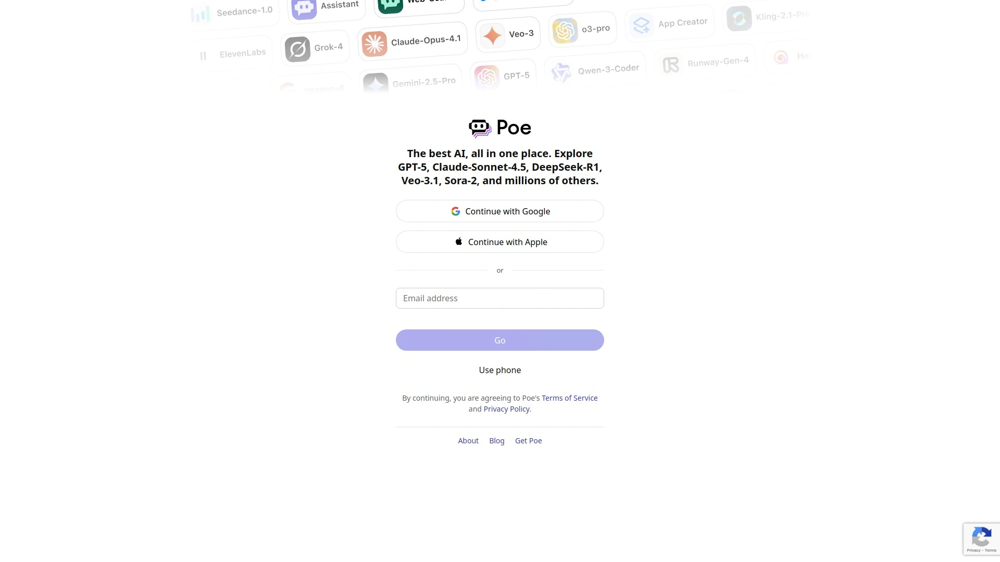

# 2025年排名前25的AI问答引擎汇总(最新整理)

还在为一堆广告和无关信息的搜索结果头疼吗？想找个问题，翻了十几页还没找到靠谱答案。是时候换个玩法了！新一代的AI问答引擎，就像你的私人研究助理，能直接给你精准、提炼好的答案，还帮你列出信息来源，让你省时又省心。不管你是写论文、做市场分析，还是单纯的好奇宝宝，下面这些工具都能让你的信息获取效率原地起飞。

## **[Perplexity AI](https://pplx.ai/ixkwood69619635)**

新一代对话式AI搜索引擎，提供带引用来源的实时答案。

Perplexity 最大的特点就是直接、不绕弯子。你问它问题，它会整合最新的网络信息，生成一段逻辑清晰的回答，并且在旁边附上所有引用来源的链接。这对于需要核查信息真实性的用户来说简直是福音。它的Pro版还提供Copilot模式，可以对你的问题进行深度追问和分析，帮你把一个话题挖得更深。你甚至可以上传文档（PDF、TXT等），让它帮你总结和问答，非常适合学生和研究人员。

## **[ChatGPT](https://chat.openai.com/)**

全球最知名的对话式AI，一个知识渊博的创意伙伴。

虽然严格来说它不是搜索引擎，但其强大的语言理解和生成能力，使其成为解决各种问题的万能钥匙。从写代码、构思营销文案到帮你制定旅行计划，ChatGPT都能胜任。免费版使用GPT-3.5模型，知识库有一定延迟，但对于绝大多数日常问题和创意写作任务已经足够强大。它的对话连贯性极佳，能记住上下文，进行多轮深入探讨。

## **[Gemini](https://gemini.google.com/)**

Google出品的AI助理，深度整合搜索与多模态能力。

作为Google的“亲儿子”，Gemini能够直接利用Google庞大的搜索数据库，提供实时、准确的信息。它最大的优势是多模态能力，你可以上传图片、文件甚至视频（部分版本）向它提问，它都能理解并给出回答。Gemini已经深度整合到Google的生态系统中，未来潜力巨大。

## **[Kimi](https://www.kimi.com/)**

国产长文本处理专家，能“读”完几十万字的文档。

Kimi在国内AI圈迅速走红，靠的就是它逆天的长文本处理能力。你可以扔给它一份几百页的PDF年报、一篇复杂的学术论文或者一本小说，它能在短时间内读完并根据你的要求进行总结、分析和问答。这对于需要快速消化大量文本信息的用户来说，是一个无价之宝。

## **[通义千问](https://tongyi.com/)**

阿里巴巴出品的全能型AI助手，功能丰富实用。

通义千问是国内大厂出品的AI模型中用户体验做得非常好的一个。它的能力非常均衡，无论是聊天、写文案、写代码，还是处理一些更复杂的任务，表现都很稳定。阿里还围绕它开发了许多有趣的功能，比如生成PPT、将照片做成跳舞视频等，可玩性很高。

## **[百度文心一言](https://yiyan.baidu.com/)**

百度推出的中文AI大模型，拥有庞大的中文数据优势。

背靠百度搜索引擎，文心一言在中文世界的理解上有着天然的优势。它能更好地理解中文语境下的复杂问题和文化背景。如果你主要处理的是中文信息，或者需要查询与中国本土相关的内容，文心一言往往能给出更接地气的回答。

## **[Claude](https://www.claude.ai/)**

注重安全与伦理的对话模型，回答更谨慎可靠。

由前OpenAI员工创立的公司Anthropic开发，Claude在设计之初就非常注重AI的安全性和可靠性。它的回答风格相对严谨，不太会“胡说八道”，因此在处理一些严肃或专业话题时，可靠性更高。此外，Claude也拥有强大的长文本处理能力，是Kimi的有力竞争者。

## **[Microsoft Copilot](https://copilot.microsoft.com/)**

深度集成于Windows和Office的AI伴侣。

Copilot（原Bing Chat）结合了OpenAI的GPT模型和Bing的实时搜索能力，可以提供带有时效性和引用来源的答案。它最大的优势是与微软生态的无缝集成，无论是在Windows操作系统、Edge浏览器还是Office全家桶里，你都能随时唤醒它，让AI成为你工作流程的一部分。

## **[Phind](https://www.phind.com/)**

专为开发者设计的AI搜索引擎，答案自带代码示例。

如果你是程序员，Phind绝对是你的菜。当你在搜索编程相关问题时，它不仅会用自然语言解释，还会直接生成可用的代码片段，并附上来源（比如Stack Overflow或官方文档）。这极大地提高了解决编程问题的效率。

## **[You.com](https://you.com/)**

可定制的AI搜索引擎，融合多种应用和模式。

You.com提供了一个非常个性化的搜索体验，它允许用户切换不同的AI模式，比如用于深度分析的“研究模式”或用于解决复杂问题的“天才模式”。它还能集成超过150个第三方应用，将来自Reddit、Stack Overflow等平台的信息直接整合在搜索结果中，让你一站式获取所需信息。

## **[讯飞星火](https://xinghuo.xfyun.cn/)**

科大讯飞出品，在语音和多模态生成上独具特色。

依托科大讯飞在语音技术领域的深厚积累，星火大模型在语音交互和理解方面表现突出。此外，它在多媒体内容生成方面也很有特色，比如可以根据你的要求生成带配音的PPT或数字人播报视频，非常适合内容创作者。

## **[智谱清言](https://chatglm.cn/)**

清华大学技术背景，学术能力扎实的国产AI。

由清华大学的技术团队孵化，智谱清言在模型的学术基础和技术严谨性上表现不错。它的回答逻辑清晰，尤其在处理一些知识性、学术性的问题时，表现稳定。

## **[Poe by Quora](https://poe.com/)**

一个集合了多种AI模型的“机器人广场”。

Poe本身不生产模型，而是像一个应用商店，聚合了来自OpenAI（ChatGPT）、Google（Gemini）、Anthropic（Claude）等公司的多种AI聊天机器人。你可以在一个App里与不同的AI模型对话，比较它们的回答差异，找到最适合当前任务的模型。

## **[天工AI](https://www.tiangong.cn/)**

昆仑万维出品，探索多模态与游戏化体验。

天工AI是国内较早探索多模态搜索的AI产品之一，它在搜索结果中会尝试融合文字、图片等多种信息。同时，它也加入了一些社交和游戏化的元素，让AI体验更有趣。

## **[Andi Search](https://andisearch.com/)**

一个界面清爽、无广告的对话式搜索引擎。

Andi的界面非常简洁，它以对话的形式呈现搜索结果，并会用图文并茂的方式进行解答。它强调无广告和保护用户隐私，对于厌倦了传统搜索引擎信息干扰的用户来说，是一个清爽的选择。

## **[Brave Search](https://search.brave.com/)**

注重隐私保护的独立搜索引擎，集成AI摘要功能。

Brave Search由隐私浏览器Brave推出，它拥有自己独立的搜索引擎索引，致力于提供一个不受大型科技公司追踪的搜索环境。它的AI摘要功能（Answer with AI）可以为你的搜索词条生成一个简明扼要的总结。

## **[Komo Search](https://komo.co/)**

强调社区和探索的AI搜索工具。

Komo提供了三种模式：聊天（Chat）、搜索（Search）和探索（Explore）。其中“探索”模式会根据你的兴趣，发现社区里正在讨论的热门话题和观点，更具社交属性。

## **[iAsk.AI](https://iask.ai/)**

追求即时答案的AI问答工具。

iAsk.AI的设计目标是提供即时、准确的单一答案，而不是一个列表。它适合用于快速查证事实或获取某个概念的简明定义，追求“一问一答”的极致效率。

## **[Decopy AI](https://decopy.ai/zh/ask-ai/)**

免费易用的在线AI问答助手。

这是一个非常简单直接的AI问答网站，无需登录即可使用。你可以通过文本、甚至上传图片来提问，它会快速给出回答。对于临时有问题的轻度用户来说非常方便。

## **[Grok](https://grok.x.ai/)**

来自xAI，风格幽默且能访问X（推特）实时数据。

由埃隆·马斯克旗下的xAI开发，Grok的最大特色是能够实时访问X平台的数据，这意味着它能回答关于最新热点事件的问题。它的回答风格被设计得带有一点叛逆和幽默感，不那么“政治正确”。

## **[Jasper](https://www.jasper.ai/)**

专注于营销和商业写作的AI内容平台。

Jasper最初是作为AI写作工具而闻名，特别擅长生成符合品牌语调的营销文案、博客文章和社交媒体内容。现在它也集成了聊天功能，让用户可以在一个平台上完成从内容构思到最终成稿的全过程。

## **[Botpress](https://botpress.com/zh/)**

一个高度可定制的开源聊天机器人平台。

对于开发者和有更高定制需求的用户来说，Botpress是一个强大的选择。它允许你构建自己的AI聊天机器人，并将其部署到网站或各种应用中。平台提供了可视化的搭建工具，同时也保留了深度开发的灵活性。

## **[watsonx.ai](https://www.ibm.com/watsonx)**

IBM出品的企业级对话式AI平台。

源自大名鼎鼎的IBM Watson，watsonx.ai主要面向企业级用户，提供构建虚拟客服、智能语音助手等解决方案。它在数据安全、系统集成和可靠性方面有着很高的标准，适合需要部署在商业环境中的严肃应用。

## **[UChat](https://www.uchat.com.au/)**

无需代码即可构建聊天机器人的平台。

UChat是一个对非技术人员非常友好的平台，它提供了拖放式的可视化界面，让任何人都可以轻松构建自己的聊天机器人。它集成了多种渠道，如网站、Facebook Messenger、WhatsApp等，方便企业统一管理客户沟通。

## **[MaxKB](https://maxkb.cn/)**

开源的企业级智能知识库问答平台。

MaxKB致力于帮助企业利用自己的内部文档和数据，构建一个专属的智能问答系统。员工可以像使用搜索引擎一样，通过提问快速找到公司知识库里的相关信息，极大地提升了内部知识管理的效率。

### **FAQ 常见问题**

* **这些AI问答引擎免费吗？**
  大多数平台都提供功能强大的免费版本，足够满足日常查询和基本任务。部分高级功能（如更强的模型、更长的上下文或更多的协作功能）可能需要付费订阅。

* **AI给出的答案可靠吗？我应该如何判断？**
  答案的可靠性取决于模型和数据源。一个好的AI问答引擎（如Perplexity）会主动提供信息来源的链接，这是判断可靠性的关键。对于任何重要信息，都建议进行交叉核对，不要完全依赖AI的单一答案。

* **我是程序员/学生/市场营销，哪个最适合我？**
  这取决于你的具体需求。程序员可以优先尝试专为代码优化的Phind；学生用Perplexity查资料、整理文献会非常高效；市场营销人员则可以利用ChatGPT或通义千问来构思文案和创意。建议多尝试几个，找到最顺手的那一个。

### **总结**

希望这份涵盖了25个工具的列表，能帮你打破传统搜索引擎的信息茧房，更高效地找到你真正需要的答案。AI问答工具正在飞速发展，它们不仅是搜索的替代品，更是激发创意、辅助决策的强大伙伴。

在众多优秀的工具中，如果你追求的是 **快速、准确且有据可查** 的答案，那么 [Perplexity AI](https://pplx.ai/ixkwood69619635) 无疑是日常研究和学习的最佳起点。现在就开始探索，让AI为你的工作和生活注入新的动力吧！
